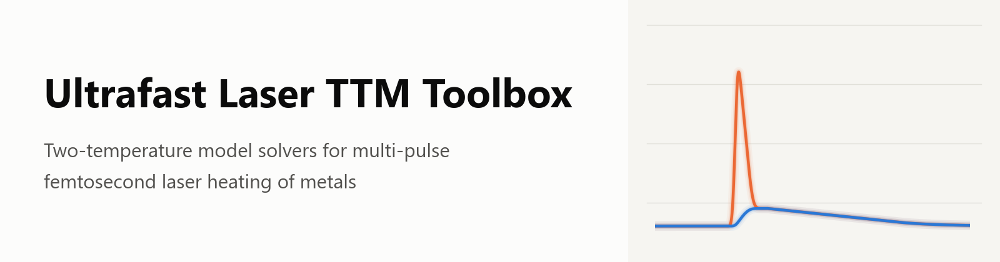
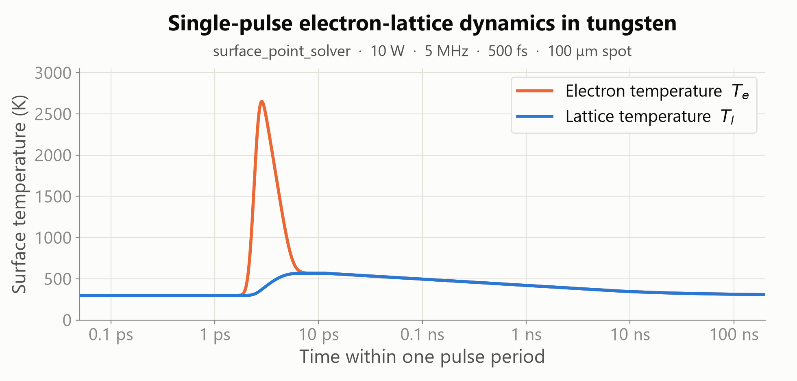
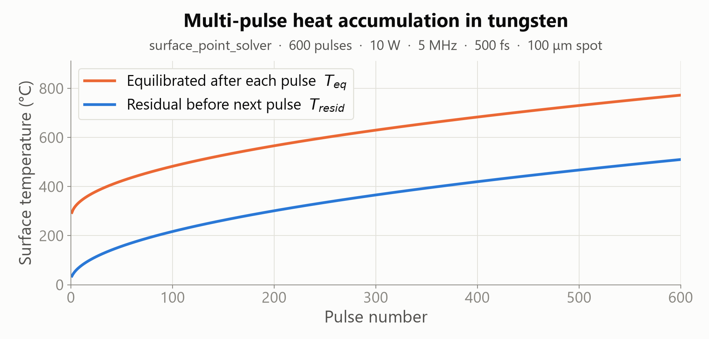
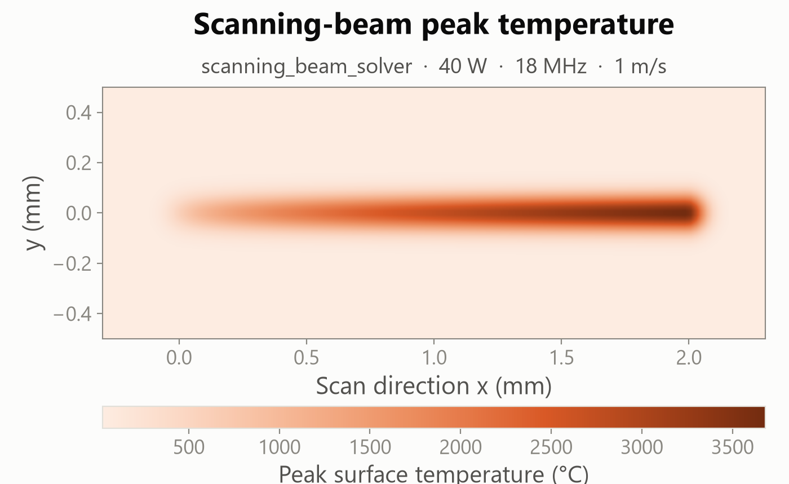
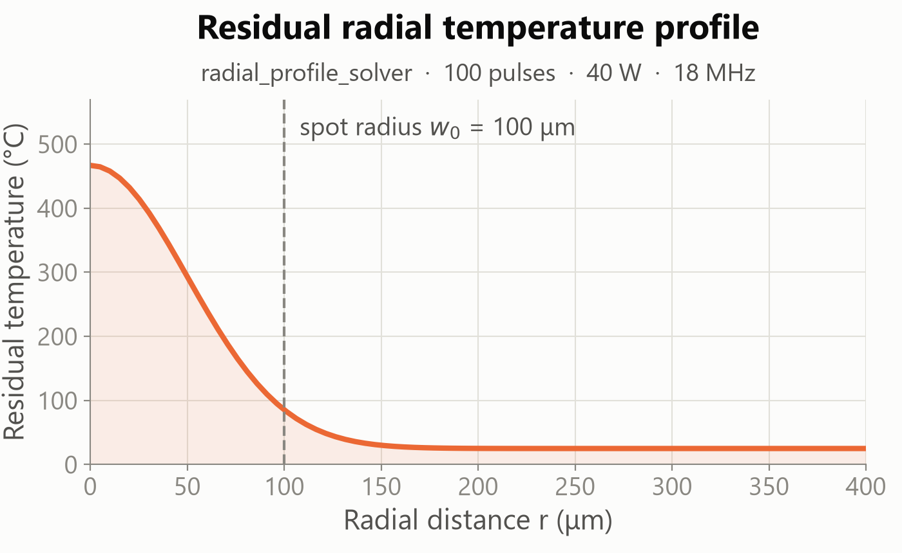

<p align="center">
  <picture>
    <source media="(prefers-color-scheme: dark)" srcset="docs/assets/banner-dark.png">
    
  </picture>
</p>

<p align="center">
  <a href="https://doi.org/10.1007/s11665-026-14738-6"></a>
  <a href="https://doi.org/10.5281/zenodo.22210435"></a>
  <a href="https://github.com/dfieser/ultrafast-laser-ttm-py/actions/workflows/ci.yml"></a>
  <a href="https://github.com/dfieser/ultrafast-laser-ttm-py/releases"></a>
  <a href="LICENSE"></a>
  
</p>

Python solvers (package **`laserttm`**) for ultrafast pulsed-laser heating of metals, built on the two-temperature model (TTM). The toolbox spans single-pulse electron-lattice dynamics on femtosecond timescales, heat accumulation over thousands of pulses, and moving-beam scans. A two-stage solution strategy keeps multi-pulse simulations fast on a laptop — no MATLAB required.

This is the Python port of the [Ultrafast Laser TTM Toolbox](https://github.com/dfieser/ultrafast-laser-ttm-toolbox), the MATLAB reference implementation for the model published in:

> Fieser, D., Dewanjee, U. N., and Hu, A. (2026). *A Computationally Efficient Two-Stage Two-Temperature Model for Multi-pulse Femtosecond Laser Heat Accumulation in Tungsten*. Journal of Materials Engineering and Performance. [doi:10.1007/s11665-026-14738-6](https://doi.org/10.1007/s11665-026-14738-6)

The defaults reflect the tungsten work in the paper, but material presets (W, Cu, Au, Al) and a `custom` mode support other metals, pulse widths, spot sizes, repetition rates, and scanning conditions.

## Highlights

- **Two-stage multi-pulse strategy.** Each pulse period splits into a full electron-lattice TTM solve (stiff BDF, or step-identical adaptive RK4 in the 0D solvers) during the pulse and relaxation, then Crank-Nicolson thermal diffusion for the inter-pulse gap. The baseline 50-pulse accumulation run finishes in well under a second.
- **Six solver entry points.** 0D surface point, 1D depth-resolved, radial profile, single-pulse visualization, electron-lattice inversion analysis, and a scanning-beam surface model.
- **Validated against the MATLAB reference.** Every solver is tested against golden fixtures generated by the MATLAB toolbox: round-off-level agreement (~1e-15 relative) for the kernel-based solvers, integrator-tolerance agreement for the stiff ones. See [Validation](#validation-against-the-matlab-reference).
- **Captures the surface temperature inversion** (lattice hotter than electrons after the pulse), which requires depth resolution and is a focus of the companion paper.
- **Config-dict interfaces.** Every solver accepts a plain `cfg` dict with the same field names and defaults as the MATLAB `cfg` structs, and returns a results dict with the same shared v1 field contract, so existing studies translate directly.
- **Pure scientific Python.** NumPy + SciPy + Numba (kernels are cached after first compile); figures in matplotlib.

## Gallery

All figures below come from the solvers in this repository at their baseline example settings. The generating script is [docs/assets/generate_gallery.py](docs/assets/generate_gallery.py).

<p align="center">
  <picture>
    <source media="(prefers-color-scheme: dark)" srcset="docs/assets/fig_single_pulse-dark.png">
    
  </picture>
</p>
<p align="center"><em>Single-pulse electron-lattice dynamics at the tungsten surface (0D solver): the electron bath spikes above 2600 K within the 500 fs pulse, then equilibrates with the lattice through electron-phonon coupling in a few picoseconds.</em></p>

<p align="center">
  <picture>
    <source media="(prefers-color-scheme: dark)" srcset="docs/assets/fig_heat_accumulation-dark.png">
    
  </picture>
</p>
<p align="center"><em>Multi-pulse heat accumulation (0D solver, 600 pulses at 5 MHz): the equilibrated and residual surface temperatures climb pulse by pulse as heat arrives faster than it diffuses away.</em></p>

<table align="center">
  <tr>
    <td align="center" width="50%">
      <picture>
        <source media="(prefers-color-scheme: dark)" srcset="docs/assets/fig_scanning_map-dark.png">
        
      </picture><br>
      <em>Scanning-beam peak-temperature footprint (40 W, 18 MHz, 1 m/s): accumulation along the scan carries the peak past tungsten's 3422 &deg;C melt point.</em>
    </td>
    <td align="center" width="50%">
      <picture>
        <source media="(prefers-color-scheme: dark)" srcset="docs/assets/fig_radial_profile-dark.png">
        
      </picture><br>
      <em>Residual radial temperature profile after 100 pulses under a Gaussian spot.</em>
    </td>
  </tr>
</table>

## Getting Started

**Requirements:** Python ≥ 3.10. NumPy, SciPy, Numba, and matplotlib are installed automatically.

1. Clone the repository and install the package:

```bash
git clone https://github.com/dfieser/ultrafast-laser-ttm-py.git
cd ultrafast-laser-ttm-py
pip install -e .          # add ".[dev]" for pytest + ruff
```

2. Run a baseline example:

```bash
python examples/run_surface_point.py
```

Or call a solver directly with your own parameters:

```python
from laserttm import surface_point_solver

cfg = {
    "material": "W",            # tungsten preset ('Cu', 'Au', 'Al', 'custom')
    "Pavg": 10,                 # average power [W]
    "spotRadius": 100e-6,       # 1/e^2 spot radius [m]
    "f_rep": 5e6,               # repetition rate [Hz]
    "tau_FWHM": 500e-15,        # pulse width, FWHM [s]
}
cfg["simDuration"] = 50 / cfg["f_rep"]   # simulate 50 pulses

results = surface_point_solver(cfg)
```

Every run writes its text output under `outputs/` and returns a `results` dict you can inspect or post-process. The first solver call in a fresh environment takes a little longer while Numba compiles the kernels; they are cached on disk after that.

**Suggested progression:**

1. `examples/run_surface_point.py` for the simplest pulse-accumulation case
2. `examples/run_depth_profile.py` for the main 1D depth-resolved model
3. `examples/run_radial_profile.py` for radial spread under a Gaussian spot
4. `examples/run_scanning_beam.py` for a moving-beam process

The MATLAB repo's [project wiki](https://github.com/dfieser/ultrafast-laser-ttm-toolbox/wiki) covers the model physics and every config field; the fields carry over one-to-one.

## Solvers

| Solver | Module | What it computes | Best use |
| --- | --- | --- | --- |
| Surface point | [surface_point.py](src/laserttm/surface_point.py) | 0D electron and lattice temperatures at the surface, with inter-pulse depth diffusion | fastest pulse-accumulation studies and sweeps |
| Depth profile | [depth_profile.py](src/laserttm/depth_profile.py) | 1D depth-resolved Te(z,t) and Tl(z,t), per-pulse peaks, inversion metrics | main multi-pulse workflow; resolves the surface inversion |
| Radial profile | [radial_profile.py](src/laserttm/radial_profile.py) | radial surface temperature under a Gaussian spot ('scale' and 'independent' modes) | melt-radius and footprint studies |
| Single pulse | [single_pulse.py](src/laserttm/single_pulse.py) | one pulse with spatial snapshots at chosen delays | early-time inspection and teaching figures |
| Inversion analysis | [inversion_quantifier.py](src/laserttm/inversion_quantifier.py) | per-pulse inversion magnitude, onset, and duration statistics | quantifying the Tl > Te inversion across pulses |
| Scanning beam | [scanning_beam.py](src/laserttm/scanning_beam.py) | 2D surface temperature under a moving beam | translating stationary results to a scanned process |

All six return a results dict with the shared v1 contract fields: `solver`, `solverId`, `contractVersion`, `material`, `outputFile`, `outputDir`, and `inputConfig`, plus `nPulses` and `wallTime_s` where meaningful — identical to the MATLAB toolbox's contract.

## Validation against the MATLAB reference

`validation/fixtures/` holds golden fixtures produced by running every solver in MATLAB R2026a (`validation/generate_fixtures.m`) at fixed configurations, including the MATLAB repo's baseline examples. The test suite re-runs each configuration in Python and asserts agreement:

- Solvers built on the hand-rolled, step-identical kernels (surface point, radial profile, scanning beam) agree to round-off: relative errors of ~1e-15, and at most 1.6e-10 K across a 36,000-pulse scan.
- Solvers built on a stiff integrator (depth profile, single pulse, inversion quantifier) run MATLAB `ode15s` vs SciPy `BDF` — the same solver family at the same tolerances — and agree at integrator-tolerance level (relative errors ~1e-4 on peak temperatures).

```bash
python -m pytest                 # fast suite (~1 min)
python -m pytest -m slow         # + the 36,000-pulse scanning baseline (~9 min)
python validation/benchmark.py   # wall-time comparison vs MATLAB
```

## Performance

Warm-run wall times on the same machine (MATLAB times recorded when the fixtures were generated; details in `validation/fixtures/manifest.json`):

| Case | MATLAB | Python | Speedup |
| --- | ---: | ---: | ---: |
| surface_point_baseline (50 pulses) | 7.11 s | 0.07 s | 108× |
| single_pulse_baseline | 1.36 s | 0.04 s | 32× |
| radial_profile_baseline (100 pulses) | 1.41 s | 0.10 s | 15× |
| depth_profile_baseline (100 pulses) | 17.60 s | 12.9 s | 1.4× |
| scanning_small (3,600 pulses) | 29.96 s | 22.9 s | 1.3× |
| scanning_baseline (36,000 pulses) | 927.2 s | 543.6 s | 1.7× |
| inversion_baseline (20 pulses) | 4.35 s | 6.1 s | 0.7× |

The depth-solver family currently mirrors the MATLAB integration windows exactly; relaxing the step cap outside the source window (the source is identically zero beyond 10·τ from each pulse center) is a planned optimization for the stiff phase.

## Repository Layout

```text
ultrafast-laser-ttm-py/
  src/laserttm/     solver package (shared Numba kernels + six solver modules)
  examples/         editable single-run baseline scripts
  tests/            golden-fixture validation suite (pytest)
  validation/       MATLAB golden fixtures, generator, and benchmark harness
  docs/assets/      banner and gallery figures + generating script
  outputs/          default destination for generated results (untracked)
```

## Documentation

- [examples/README.md](examples/README.md): example selection and editing pattern
- [validation/README.md](validation/README.md): how the fixture validation works
- [MATLAB reference repository](https://github.com/dfieser/ultrafast-laser-ttm-toolbox) and its [wiki](https://github.com/dfieser/ultrafast-laser-ttm-toolbox/wiki): model background and solver-by-solver reference

## How to Cite

If this toolbox contributes to published work, please cite the article:

```bibtex
@article{fieser2026twostage,
  author    = {Fieser, David and Dewanjee, Unmanaa Nileen and Hu, Anming},
  title     = {A Computationally Efficient Two-Stage Two-Temperature Model for
               Multi-pulse Femtosecond Laser Heat Accumulation in Tungsten},
  journal   = {Journal of Materials Engineering and Performance},
  publisher = {Springer},
  year      = {2026},
  doi       = {10.1007/s11665-026-14738-6},
}
```

To cite the software itself, use the version DOI from the Zenodo record (concept DOI [10.5281/zenodo.22210435](https://doi.org/10.5281/zenodo.22210435) always resolves to the latest release) or the metadata in [CITATION.cff](CITATION.cff):

```bibtex
@software{fieser_ttm_toolbox_py,
  author = {Fieser, David},
  title  = {Ultrafast Laser TTM Toolbox (Python)},
  year   = {2026},
  doi    = {10.5281/zenodo.22210435},
  url    = {https://github.com/dfieser/ultrafast-laser-ttm-py},
}
```

The MATLAB reference implementation has its own record (concept DOI [10.5281/zenodo.20389305](https://doi.org/10.5281/zenodo.20389305)).

## Versioning and Releases

The `VERSION` file at the repository root is the single source of truth: the package version is read from it at build time (`[tool.hatch.version]` in `pyproject.toml`) and exposed at runtime as `laserttm.__version__`. Every push to `main` is automatically published as a GitHub release — the [release workflow](.github/workflows/release.yml) bumps the patch number in `VERSION`, tags the commit, and publishes; Zenodo then archives the release under a new version DOI. To jump to a new minor or major version, edit `VERSION` yourself in your push and that exact version is released instead.

## License

Released under the MIT License. See [LICENSE](LICENSE).

## Acknowledgments and Funding

This work was supported by the National Science Foundation under Award No. CMMI-2412544, Collaborative Research: Additive Manufacturing of Crack-Free Tungsten Using Ultrashort Pulsed Lasers (PI: Dr. Anming Hu, Division of Civil, Mechanical, and Manufacturing Innovation, NSF Program: AM-Advanced Manufacturing).

The authors gratefully acknowledge Drs. Yanfei Gao, Wenda Tan, and Seungha Shin for their contributions and collaboration on this project.

Additional support was provided by the University of Tennessee, Knoxville, through a hiring package. D.F. gratefully acknowledges support from the UTK 100 Talented PhD Scholarship.

Support for the Center for Materials Processing from the State of Tennessee and the Tennessee Higher Education Commission is also gratefully acknowledged.

## Contributing

Bug fixes, portability improvements, and documentation polish are welcome. See [CONTRIBUTING.md](CONTRIBUTING.md) for scope guidance.
